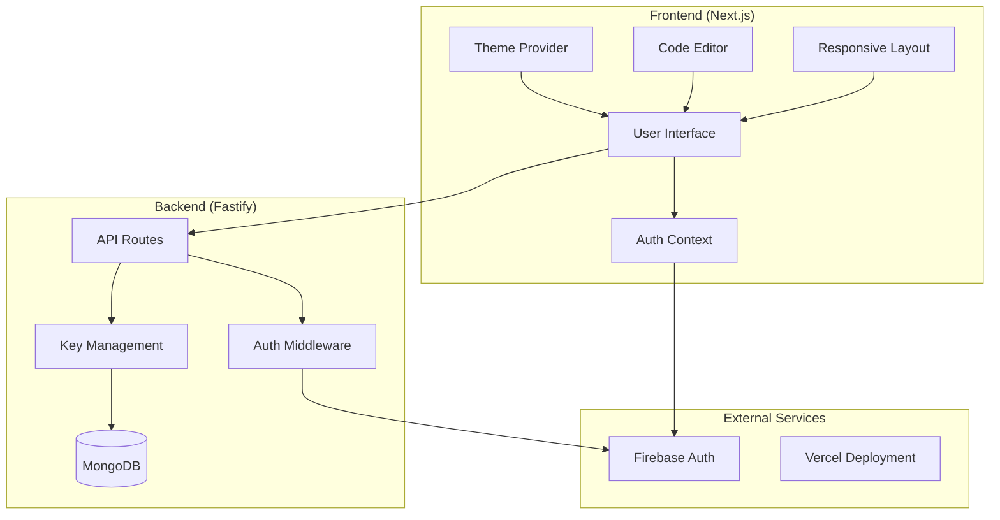
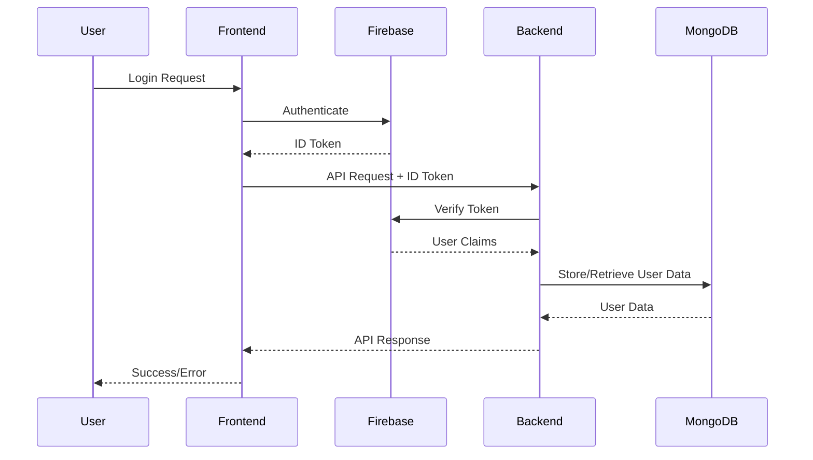

# Design Document

## Overview

This document outlines the technical design for enhancing the EIOR app with authentication fixes, responsive design improvements, code editor integration, and theme toggle functionality. The EIOR app is a full-stack application that provides API key management and AI-powered generation services through a modern web interface.

### Current Architecture

The EIOR app consists of:
- **Frontend**: Next.js 14+ with React, TypeScript, and Tailwind CSS
- **Backend**: Node.js with Fastify framework and MongoDB
- **Authentication**: Firebase Auth with custom JWT token exchange
- **Deployment**: Vercel for both frontend and backend
- **UI Components**: Custom component library built with Tailwind and class-variance-authority

### Enhancement Goals

1. **Fix API Key Authentication**: Resolve authentication issues preventing users from creating API keys
2. **Implement Responsive Design**: Ensure seamless experience across mobile, tablet, and desktop devices
3. **Integrate Code Editor**: Add Monaco Editor for in-app code writing and testing
4. **Add Theme Toggle System**: Implement light/dark mode switching with persistence
5. **Maintain Performance**: Ensure enhancements don't degrade existing performance

## Architecture

### System Architecture Overview



### Authentication Architecture

The authentication system will be enhanced to properly handle Firebase token validation:



### Component Architecture

The frontend will be restructured with enhanced component organization:

```
frontend/
├── app/                    # Next.js App Router
├── components/
│   ├── ui/                # Base UI components
│   ├── layout/            # Layout components
│   ├── editor/            # Code editor components
│   └── theme/             # Theme-related components
├── context/
│   ├── AuthContext.tsx    # Enhanced auth context
│   └── ThemeContext.tsx   # New theme context
├── hooks/                 # Custom React hooks
├── lib/                   # Utility libraries
└── styles/                # Global styles and themes
```

## Components and Interfaces

### Enhanced Authentication Context

```typescript
interface AuthContextType {
  user: User | null;
  loading: boolean;
  backendConnected: boolean;
  setUser: (user: User | null) => void;
  logout: () => void;
  refreshUser: () => Promise<void>;
  createApiKey: (name: string) => Promise<ApiKeyCreated>;
}
```

### Theme Context Interface

```typescript
interface ThemeContextType {
  theme: 'light' | 'dark';
  setTheme: (theme: 'light' | 'dark') => void;
  toggleTheme: () => void;
}

interface ThemeProviderProps {
  children: React.ReactNode;
  defaultTheme?: 'light' | 'dark';
  storageKey?: string;
}
```

### Code Editor Component Interface

```typescript
interface CodeEditorProps {
  value: string;
  onChange: (value: string) => void;
  language: 'javascript' | 'python' | 'json';
  theme?: 'light' | 'dark';
  height?: string;
  options?: monaco.editor.IStandaloneEditorConstructionOptions;
}

interface CodeEditorState {
  files: Record<string, string>;
  activeFile: string;
  output: string;
  isExecuting: boolean;
}
```

### Responsive Layout System

```typescript
interface ResponsiveLayoutProps {
  children: React.ReactNode;
  sidebar?: React.ReactNode;
  header?: React.ReactNode;
}

interface BreakpointConfig {
  mobile: number;    // < 768px
  tablet: number;    // 768px - 1024px
  desktop: number;   // > 1024px
}
```

### API Key Management Interface

```typescript
interface ApiKeyManager {
  create: (name: string) => Promise<ApiKeyCreated>;
  list: () => Promise<{ keys: ApiKeyPreview[] }>;
  revoke: (keyId: string) => Promise<void>;
  validate: (key: string) => Promise<boolean>;
}

interface ApiKeyCreated {
  id: string;
  key: string;
  name: string;
  createdAt: string;
}

interface ApiKeyPreview {
  id: string;
  name: string;
  keyPreview: string;
  usageCount: number;
  createdAt: string;
  active: boolean;
}
```

## Data Models

### User Data Model

```typescript
interface User {
  id: string;
  email: string;
  name: string;
  plan: 'free' | 'pro' | 'enterprise';
  imageCredits: number;
  videoCredits: number;
  createdAt: string;
  updatedAt: string;
}
```

### API Key Data Model

```typescript
interface ApiKey {
  id: string;
  userId: string;
  name: string;
  keyHash: string;
  keyPreview: string;
  usageCount: number;
  active: boolean;
  createdAt: string;
  lastUsedAt?: string;
}
```

### Theme Configuration Model

```typescript
interface ThemeConfig {
  name: string;
  colors: {
    background: string;
    foreground: string;
    primary: string;
    secondary: string;
    muted: string;
    accent: string;
    destructive: string;
    border: string;
    input: string;
    ring: string;
  };
  borderRadius: string;
}
```

### Code Editor Session Model

```typescript
interface EditorSession {
  id: string;
  userId: string;
  files: Record<string, string>;
  activeFile: string;
  language: string;
  createdAt: string;
  updatedAt: string;
}
```

## Correctness Properties

*A property is a characteristic or behavior that should hold true across all valid executions of a system-essentially, a formal statement about what the system should do. Properties serve as the bridge between human-readable specifications and machine-verifiable correctness guarantees.*

### Property 1: Authentication Validation for API Key Creation

*For any* user attempting to create an API key, the API_Key_Manager should validate authentication status and only allow creation for authenticated users.

**Validates: Requirements 1.1**

### Property 2: API Key Uniqueness

*For any* set of API keys generated by the system, all keys should be unique regardless of creation time or user.

**Validates: Requirements 1.2**

### Property 3: Unauthenticated User Error Response

*For any* unauthenticated user attempting to create an API key, the Authentication_System should return a clear error message with authentication instructions.

**Validates: Requirements 1.3**

### Property 4: Dashboard Key Display Update

*For any* successfully created API key, the Dashboard should immediately display the new key in the user interface.

**Validates: Requirements 1.4**

### Property 5: API Key Database Storage

*For any* created API key, the API_Key_Manager should store it in MongoDB with proper user association and all required fields.

**Validates: Requirements 1.5**

### Property 6: Mobile Navigation Responsiveness

*For any* mobile device viewport (width < 768px), the EIOR_App should display navigation in a collapsible menu format.

**Validates: Requirements 2.1**

### Property 7: Tablet Layout Adaptation

*For any* tablet device viewport (768px ≤ width ≤ 1024px), the EIOR_App should adapt layout to utilize available screen space efficiently.

**Validates: Requirements 2.2**

### Property 8: Desktop Layout Display

*For any* desktop device viewport (width > 1024px), the EIOR_App should display full navigation and optimal layout spacing.

**Validates: Requirements 2.3**

### Property 9: Responsive Content Reflow

*For any* device category (mobile, tablet, desktop), the Dashboard should reflow content appropriately for that viewport size.

**Validates: Requirements 2.4**

### Property 10: Orientation Change Adaptation

*For any* screen orientation change event, the EIOR_App should adjust layout to accommodate the new orientation.

**Validates: Requirements 2.5**

### Property 11: Cross-Device Functionality

*For any* supported device size, the EIOR_App should maintain all core functionality without degradation.

**Validates: Requirements 2.6**

### Property 12: Mobile Input Layout Stability

*For any* text input field focused on mobile devices, the EIOR_App should prevent layout shifting that affects user experience.

**Validates: Requirements 2.7**

### Property 13: Code Editor Syntax Highlighting

*For any* code input in JavaScript, Python, or JSON, the Code_Editor should provide appropriate syntax highlighting.

**Validates: Requirements 3.1**

### Property 14: Real-time Syntax Validation

*For any* code typed in the Code_Editor, the system should provide real-time syntax validation feedback.

**Validates: Requirements 3.2**

### Property 15: Editor Feature Functionality

*For any* basic editing operation (undo, redo, find, replace), the Code_Editor should execute the operation correctly.

**Validates: Requirements 3.3**

### Property 16: Code Execution Output Display

*For any* code execution request, the Code_Editor should display results in the dedicated output panel.

**Validates: Requirements 3.4**

### Property 17: Auto-save Functionality

*For any* user code in the Code_Editor, the system should automatically save changes at regular intervals.

**Validates: Requirements 3.5**

### Property 18: File Switching Change Preservation

*For any* file switch operation in the Code_Editor, unsaved changes in the previous file should be preserved.

**Validates: Requirements 3.6**

### Property 19: Code Folding Support

*For any* large code file in the Code_Editor, the system should support code folding for better navigation.

**Validates: Requirements 3.7**

### Property 20: Mobile Editor Touch Controls

*For any* mobile device accessing the Code_Editor, the system should provide touch-friendly controls.

**Validates: Requirements 3.8**

### Property 21: Theme Toggle Switching

*For any* theme toggle interaction, the Theme_System should switch between light and dark modes.

**Validates: Requirements 4.2**

### Property 22: Theme Persistence

*For any* theme selection, the Theme_System should persist the preference in browser local storage.

**Validates: Requirements 4.3**

### Property 23: Theme Restoration

*For any* app reload or return visit, the Theme_System should load the user's previously selected theme from storage.

**Validates: Requirements 4.4**

### Property 24: Consistent Theme Application

*For any* theme change, the Theme_System should apply consistent theming across all app components including Dashboard, Code_Editor, and navigation.

**Validates: Requirements 4.5**

### Property 25: Dark Mode Accessibility

*For any* component in dark mode, the Theme_System should use high contrast colors that meet accessibility standards.

**Validates: Requirements 4.6**

### Property 26: Light Mode Accessibility

*For any* component in light mode, the Theme_System should use colors that meet WCAG contrast requirements.

**Validates: Requirements 4.7**

### Property 27: Theme Transition Smoothness

*For any* theme change operation, the Theme_System should provide smooth visual transitions.

**Validates: Requirements 4.8**

### Property 28: Theme Switching Responsiveness

*For any* theme switching operation, the EIOR_App should maintain responsive user interactions without blocking.

**Validates: Requirements 5.2**

### Property 29: Firebase Authentication Compatibility

*For any* existing Firebase authentication method, the enhanced Authentication_System should continue to support it.

**Validates: Requirements 6.1**

### Property 30: API Key Management Preservation

*For any* existing API key management operation, the enhanced Dashboard should maintain the same functionality.

**Validates: Requirements 6.2**

### Property 31: Usage Tracking Preservation

*For any* usage tracking or billing operation, the enhanced EIOR_App should preserve existing functionality.

**Validates: Requirements 6.3**

### Property 32: API Endpoint Compatibility

*For any* existing API endpoint, the enhanced EIOR_App should maintain compatibility and correct responses.

**Validates: Requirements 6.4**

### Property 33: Feature Functionality Preservation

*For any* existing feature accessed by users, the enhanced EIOR_App should provide the same functionality as before enhancements.

**Validates: Requirements 6.5**

## Error Handling

### Authentication Errors

The system will implement comprehensive error handling for authentication scenarios:

1. **Invalid Firebase Tokens**: Return 401 Unauthorized with clear error messages
2. **Expired Tokens**: Automatically refresh tokens or prompt re-authentication
3. **Network Failures**: Implement retry logic with exponential backoff
4. **Rate Limiting**: Implement proper rate limiting with informative error responses

```typescript
interface AuthError {
  code: 'INVALID_TOKEN' | 'EXPIRED_TOKEN' | 'NETWORK_ERROR' | 'RATE_LIMITED';
  message: string;
  retryAfter?: number;
}
```

### API Key Management Errors

API key operations will handle various error conditions:

1. **Duplicate Key Names**: Allow duplicate names but ensure unique keys
2. **Database Connection Failures**: Implement connection pooling and retry logic
3. **Key Generation Failures**: Retry with different entropy sources
4. **Validation Errors**: Provide specific field-level error messages

```typescript
interface ApiKeyError {
  code: 'GENERATION_FAILED' | 'STORAGE_FAILED' | 'VALIDATION_ERROR' | 'NOT_FOUND';
  message: string;
  field?: string;
}
```

### Responsive Design Errors

Handle viewport and layout-related errors gracefully:

1. **Unsupported Viewports**: Provide fallback layouts for edge cases
2. **CSS Loading Failures**: Implement critical CSS inlining
3. **JavaScript Failures**: Ensure basic functionality without JavaScript
4. **Touch Event Errors**: Provide mouse/keyboard alternatives

### Code Editor Errors

The integrated code editor will handle various error scenarios:

1. **Monaco Loading Failures**: Provide fallback textarea editor
2. **Syntax Errors**: Display clear error messages with line numbers
3. **Execution Timeouts**: Implement execution time limits with clear messaging
4. **File Size Limits**: Warn users before reaching limits

```typescript
interface EditorError {
  code: 'SYNTAX_ERROR' | 'EXECUTION_TIMEOUT' | 'FILE_TOO_LARGE' | 'LOAD_FAILED';
  message: string;
  line?: number;
  column?: number;
}
```

### Theme System Errors

Theme-related error handling:

1. **Storage Failures**: Fall back to system preference or default theme
2. **CSS Variable Errors**: Provide fallback color values
3. **Transition Failures**: Disable transitions on older browsers
4. **Accessibility Violations**: Log warnings and provide high-contrast alternatives

## Testing Strategy

### Dual Testing Approach

The testing strategy employs both unit testing and property-based testing to ensure comprehensive coverage:

- **Unit tests**: Verify specific examples, edge cases, and error conditions
- **Property tests**: Verify universal properties across all inputs
- Both approaches are complementary and necessary for comprehensive coverage

### Unit Testing Focus Areas

Unit tests will concentrate on:
- Specific examples that demonstrate correct behavior
- Integration points between components
- Edge cases and error conditions
- Component rendering and user interactions
- API endpoint responses and error handling

### Property-Based Testing Configuration

Property-based testing will be implemented using **fast-check** for JavaScript/TypeScript:
- Minimum 100 iterations per property test
- Each property test references its design document property
- Tag format: **Feature: eior-app-enhancements, Property {number}: {property_text}**
- Each correctness property implemented by a SINGLE property-based test

### Testing Implementation Plan

#### Authentication Testing
```typescript
// Property test example
describe('Authentication Properties', () => {
  it('should validate authentication for API key creation', () => {
    fc.assert(fc.property(
      fc.record({
        user: fc.option(fc.record({ id: fc.string(), email: fc.string() })),
        keyName: fc.string()
      }),
      async ({ user, keyName }) => {
        // Feature: eior-app-enhancements, Property 1: Authentication Validation for API Key Creation
        const result = await apiKeyManager.create(keyName, user);
        if (user) {
          expect(result).toBeDefined();
        } else {
          expect(result).toThrow(/authentication/i);
        }
      }
    ), { numRuns: 100 });
  });
});
```

#### Responsive Design Testing
```typescript
describe('Responsive Design Properties', () => {
  it('should adapt navigation for mobile viewports', () => {
    fc.assert(fc.property(
      fc.integer({ min: 320, max: 767 }), // Mobile viewport widths
      (width) => {
        // Feature: eior-app-enhancements, Property 6: Mobile Navigation Responsiveness
        const { container } = render(<App />);
        Object.defineProperty(window, 'innerWidth', { value: width });
        window.dispatchEvent(new Event('resize'));
        
        const navigation = container.querySelector('[data-testid="navigation"]');
        expect(navigation).toHaveClass('collapsible-menu');
      }
    ), { numRuns: 100 });
  });
});
```

#### Theme System Testing
```typescript
describe('Theme System Properties', () => {
  it('should persist theme preferences', () => {
    fc.assert(fc.property(
      fc.constantFrom('light', 'dark'),
      (theme) => {
        // Feature: eior-app-enhancements, Property 22: Theme Persistence
        const themeSystem = new ThemeSystem();
        themeSystem.setTheme(theme);
        
        const stored = localStorage.getItem('theme');
        expect(stored).toBe(theme);
      }
    ), { numRuns: 100 });
  });
});
```

#### Code Editor Testing
```typescript
describe('Code Editor Properties', () => {
  it('should provide syntax highlighting for supported languages', () => {
    fc.assert(fc.property(
      fc.constantFrom('javascript', 'python', 'json'),
      fc.string(),
      (language, code) => {
        // Feature: eior-app-enhancements, Property 13: Code Editor Syntax Highlighting
        const editor = new CodeEditor({ language, value: code });
        const highlightedElements = editor.getHighlightedElements();
        
        if (code.trim()) {
          expect(highlightedElements.length).toBeGreaterThan(0);
        }
      }
    ), { numRuns: 100 });
  });
});
```

### Integration Testing

Integration tests will verify:
- End-to-end user workflows
- API integration with Firebase Auth
- Database operations and data consistency
- Cross-browser compatibility
- Performance benchmarks

### Accessibility Testing

Accessibility testing will ensure:
- WCAG 2.1 AA compliance
- Screen reader compatibility
- Keyboard navigation support
- Color contrast requirements
- Focus management

### Performance Testing

Performance tests will validate:
- Page load times under 2 seconds
- Theme switching responsiveness
- Code editor performance with large files
- Memory usage constraints
- Mobile device performance