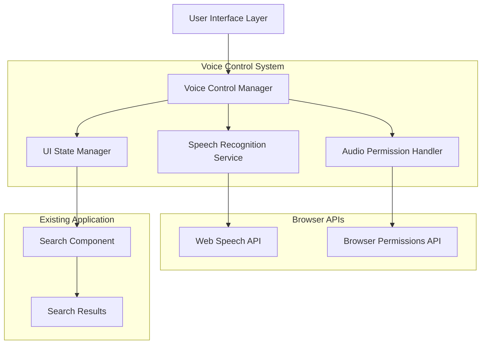
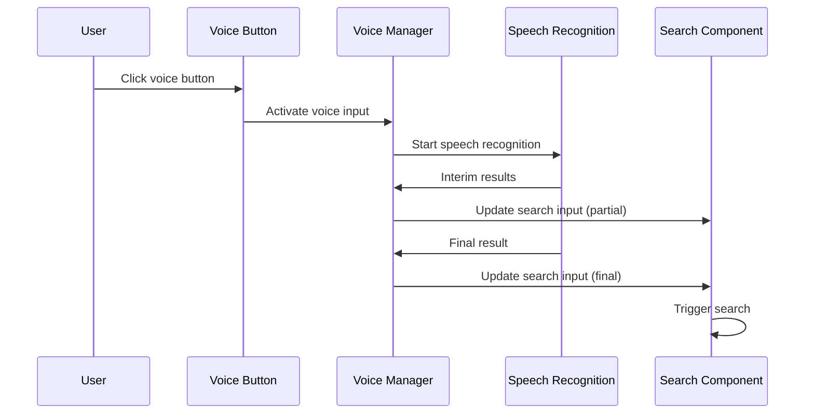

# Design Document: Voice Control Search

## Overview

The voice control search feature integrates speech recognition capabilities into the existing search component, allowing users to speak their search queries instead of typing them. This implementation leverages the Web Speech API to provide a seamless voice-to-text experience while maintaining full compatibility with existing search functionality.

The system follows a modular architecture with clear separation between voice input handling, speech processing, and search integration. The design prioritizes accessibility, privacy, and cross-browser compatibility while providing intuitive user feedback throughout the voice interaction process.

## Architecture

### High-Level Architecture



### Component Interaction Flow



## Components and Interfaces

### VoiceControlManager

The central orchestrator for all voice control functionality.

```typescript
interface VoiceControlManager {
  // State management
  isListening: boolean;
  isSupported: boolean;
  hasPermission: boolean;
  
  // Core methods
  startListening(): Promise<void>;
  stopListening(): void;
  checkSupport(): boolean;
  requestPermission(): Promise<boolean>;
  
  // Event handlers
  onTranscriptionUpdate(callback: (text: string, isFinal: boolean) => void): void;
  onError(callback: (error: VoiceError) => void): void;
  onStateChange(callback: (state: VoiceState) => void): void;
}
```

### SpeechRecognitionService

Wrapper around the Web Speech API with enhanced error handling and browser compatibility.

```typescript
interface SpeechRecognitionService {
  // Configuration
  language: string;
  continuous: boolean;
  interimResults: boolean;
  maxAlternatives: number;
  
  // Methods
  start(): void;
  stop(): void;
  abort(): void;
  isSupported(): boolean;
  
  // Events
  onResult(callback: (results: SpeechRecognitionResultList) => void): void;
  onError(callback: (error: SpeechRecognitionError) => void): void;
  onStart(callback: () => void): void;
  onEnd(callback: () => void): void;
}
```

### VoiceInputButton

React component providing the voice activation UI control.

```typescript
interface VoiceInputButtonProps {
  isListening: boolean;
  isSupported: boolean;
  hasPermission: boolean;
  onToggleListening: () => void;
  disabled?: boolean;
  className?: string;
}

interface VoiceInputButtonState {
  animationState: 'idle' | 'listening' | 'processing';
  showPermissionPrompt: boolean;
}
```

### AudioPermissionHandler

Manages microphone permissions and provides user feedback.

```typescript
interface AudioPermissionHandler {
  checkPermission(): Promise<PermissionState>;
  requestPermission(): Promise<boolean>;
  handlePermissionDenied(): void;
  getPermissionInstructions(): string;
}

type PermissionState = 'granted' | 'denied' | 'prompt';
```

### TranscriptionHandler

Processes speech recognition results and integrates with search input.

```typescript
interface TranscriptionHandler {
  processInterimResult(text: string): void;
  processFinalResult(text: string): void;
  clearTranscription(): void;
  formatTranscription(text: string): string;
}
```

## Data Models

### VoiceState

```typescript
type VoiceState = 
  | 'idle'           // Ready to start listening
  | 'requesting'     // Requesting microphone permission
  | 'listening'      // Actively listening for speech
  | 'processing'     // Processing speech recognition results
  | 'completed'      // Transcription completed successfully
  | 'error'          // Error state
  | 'unsupported';   // Browser doesn't support Web Speech API
```

### VoiceError

```typescript
interface VoiceError {
  type: 'permission' | 'network' | 'recognition' | 'timeout' | 'browser';
  message: string;
  code?: string;
  recoverable: boolean;
}
```

### VoiceConfig

```typescript
interface VoiceConfig {
  // Speech recognition settings
  language: string;
  maxDuration: number;        // Maximum recording time in ms
  silenceTimeout: number;     // Auto-stop after silence in ms
  interimResults: boolean;    // Show partial results
  
  // UI settings
  showVisualFeedback: boolean;
  autoSearch: boolean;        // Trigger search after transcription
  
  // Accessibility
  announceStateChanges: boolean;
  keyboardShortcut?: string;
}
```

### SearchIntegration

```typescript
interface SearchIntegration {
  updateSearchInput(text: string, isFinal: boolean): void;
  triggerSearch(): void;
  preserveSearchState(): void;
  restoreSearchState(): void;
}
```

## Error Handling

### Error Classification

1. **Permission Errors**: Microphone access denied or blocked
2. **Browser Compatibility Errors**: Web Speech API not supported
3. **Network Errors**: Speech recognition service unavailable
4. **Recognition Errors**: Speech not understood or processing failed
5. **Timeout Errors**: No speech detected within time limit

### Error Recovery Strategies

```typescript
class VoiceErrorHandler {
  handleError(error: VoiceError): void {
    switch (error.type) {
      case 'permission':
        this.showPermissionInstructions();
        break;
      case 'network':
        this.showRetryOption();
        break;
      case 'recognition':
        this.promptUserToRepeat();
        break;
      case 'timeout':
        this.resetToIdleState();
        break;
      case 'browser':
        this.hideVoiceFeature();
        break;
    }
  }
  
  private showPermissionInstructions(): void {
    // Display browser-specific permission instructions
  }
  
  private showRetryOption(): void {
    // Offer user option to try voice input again
  }
  
  private promptUserToRepeat(): void {
    // Ask user to speak more clearly or try again
  }
}
```

### Graceful Degradation

- When Web Speech API is unavailable, voice button is hidden
- When microphone permission is denied, clear instructions are provided
- When speech recognition fails, manual text input remains fully functional
- All voice control errors preserve existing search functionality

## Testing Strategy

### Unit Testing Approach

Unit tests will focus on individual component behavior, error handling, and integration points:

- **VoiceControlManager**: Test state transitions, permission handling, and error scenarios
- **SpeechRecognitionService**: Mock Web Speech API interactions and test error conditions
- **VoiceInputButton**: Test UI states, accessibility features, and user interactions
- **TranscriptionHandler**: Test text processing, formatting, and search integration

### Property-Based Testing Configuration

Property-based tests will use **fast-check** library for JavaScript/TypeScript to verify universal properties across randomized inputs. Each test will run a minimum of 100 iterations and include tags referencing the corresponding design properties.

Test configuration example:
```typescript
import fc from 'fast-check';

// Property test with proper tagging
describe('Voice Control Properties', () => {
  it('should preserve search functionality', () => {
    // Feature: voice-control-search, Property 1: Voice input preserves search behavior
    fc.assert(fc.property(
      fc.string(),
      (searchText) => {
        // Test implementation
      }
    ), { numRuns: 100 });
  });
});
```

### Integration Testing

- Test voice control integration with existing search component
- Verify browser compatibility across Chrome, Firefox, Safari, and Edge
- Test microphone permission flows in different browser contexts
- Validate accessibility features with screen readers and keyboard navigation

### End-to-End Testing

- Complete voice-to-search workflows
- Error recovery scenarios
- Cross-browser compatibility validation
- Accessibility compliance verification

## Correctness Properties

*A property is a characteristic or behavior that should hold true across all valid executions of a system-essentially, a formal statement about what the system should do. Properties serve as the bridge between human-readable specifications and machine-verifiable correctness guarantees.*

### Property 1: UI State Consistency

*For any* voice control session, the user interface should consistently reflect the current system state with appropriate visual indicators during listening, processing, and recording phases.

**Validates: Requirements 1.4, 2.2, 5.3, 6.3**

### Property 2: Speech Recognition Pipeline

*For any* valid speech input, the system should process it through the complete pipeline: convert speech to text, display interim results during processing, and populate the final transcribed text in the search input.

**Validates: Requirements 2.1, 2.3, 2.4**

### Property 3: Search Integration Preservation

*For any* voice-transcribed search query, the search functionality should behave identically to manually typed queries, including automatic search triggering, history preservation, and maintenance of all existing search features.

**Validates: Requirements 3.1, 3.2, 3.3, 3.4**

### Property 4: Error Recovery and Resilience

*For any* voice control error or failure, the system should handle it gracefully by displaying appropriate error messages, resetting to a stable state, logging errors appropriately, and ensuring manual text input remains fully functional.

**Validates: Requirements 2.5, 4.4, 7.4, 7.5**

### Property 5: Controlled Microphone Access

*For any* microphone access request, it should only occur after explicit user interaction and should automatically terminate after a reasonable timeout period to protect user privacy.

**Validates: Requirements 6.1, 6.4**

### Property 6: Accessibility Feedback

*For any* voice control state change or recording event, the system should provide appropriate feedback through screen reader announcements and audio/visual cues to ensure accessibility.

**Validates: Requirements 5.2, 5.4**

### Property 7: Timeout Handling

*For any* voice recording session that exceeds the maximum duration or encounters silence timeout, the system should automatically stop recording and provide clear feedback to the user.

**Validates: Requirements 5.5, 6.4**

## Error Handling

### Error Classification and Recovery

The voice control system implements comprehensive error handling across multiple failure modes:

#### Permission Errors
- **Scenario**: Microphone access denied or blocked
- **Recovery**: Display browser-specific instructions for enabling microphone permissions
- **User Feedback**: Clear modal or inline message with step-by-step permission instructions
- **Fallback**: Voice button remains visible but disabled with explanatory tooltip

#### Browser Compatibility Errors  
- **Scenario**: Web Speech API not supported in current browser
- **Recovery**: Gracefully hide voice control features
- **User Feedback**: No error message needed - feature simply not available
- **Fallback**: Search functionality remains fully operational without voice features

#### Speech Recognition Errors
- **Scenario**: Speech not understood, processing failed, or no speech detected
- **Recovery**: Reset to idle state and prompt user to try again
- **User Feedback**: Friendly message suggesting clearer speech or retry
- **Fallback**: Manual text input remains available

#### Network Connectivity Errors
- **Scenario**: Speech recognition service unavailable due to network issues
- **Recovery**: Display retry option with network troubleshooting suggestions
- **User Feedback**: Clear indication that network connectivity is required
- **Fallback**: Offline functionality maintains manual search capabilities

#### Timeout Errors
- **Scenario**: No speech detected within configured time limit
- **Recovery**: Automatically stop recording and return to ready state
- **User Feedback**: Gentle notification that listening has stopped due to inactivity
- **Fallback**: User can immediately retry voice input or use manual input

### Error State Management

```typescript
interface ErrorState {
  type: VoiceErrorType;
  message: string;
  recoverable: boolean;
  retryAction?: () => void;
  instructionsUrl?: string;
}

class VoiceErrorManager {
  handleError(error: VoiceError): ErrorState {
    const errorState = this.classifyError(error);
    this.logError(error);
    this.notifyUser(errorState);
    this.resetSystemState();
    return errorState;
  }
  
  private classifyError(error: VoiceError): ErrorState {
    // Determine error type and appropriate recovery strategy
  }
  
  private logError(error: VoiceError): void {
    // Log error details while preserving user privacy
  }
}
```

## Testing Strategy

### Dual Testing Approach

The voice control search feature requires both unit testing and property-based testing to ensure comprehensive coverage:

**Unit Tests** focus on:
- Specific user interaction examples (button clicks, permission flows)
- Edge cases and error conditions (network failures, permission denials)
- Integration points between voice control and existing search functionality
- Browser-specific compatibility scenarios

**Property Tests** focus on:
- Universal properties that hold across all voice inputs and system states
- Comprehensive input coverage through randomized speech recognition results
- State transition correctness across all possible user interaction sequences
- Error handling consistency across different failure scenarios

### Property-Based Testing Configuration

The implementation will use **fast-check** library for JavaScript/TypeScript property-based testing:

- **Minimum 100 iterations** per property test to ensure statistical confidence
- **Randomized input generation** for speech recognition results, user interactions, and system states
- **Property test tagging** with format: `Feature: voice-control-search, Property {number}: {property_text}`
- **Shrinking support** to identify minimal failing cases when properties fail

Example property test structure:
```typescript
import fc from 'fast-check';

describe('Voice Control Properties', () => {
  it('should maintain UI state consistency', () => {
    // Feature: voice-control-search, Property 1: UI State Consistency
    fc.assert(fc.property(
      fc.record({
        isListening: fc.boolean(),
        isProcessing: fc.boolean(),
        hasError: fc.boolean()
      }),
      (voiceState) => {
        const uiState = renderVoiceControlUI(voiceState);
        // Verify UI reflects voice state consistently
        expect(uiState.showsListeningIndicator).toBe(voiceState.isListening);
        expect(uiState.showsProcessingIndicator).toBe(voiceState.isProcessing);
        expect(uiState.showsErrorState).toBe(voiceState.hasError);
      }
    ), { numRuns: 100 });
  });
});
```

### Integration Testing Strategy

- **Cross-browser compatibility testing** across Chrome, Firefox, Safari, and Edge
- **Permission flow testing** in different browser security contexts
- **Accessibility testing** with screen readers and keyboard navigation
- **Performance testing** for speech recognition latency and resource usage
- **End-to-end workflow testing** from voice activation through search completion

### Test Coverage Requirements

- **Unit test coverage**: Minimum 90% code coverage for voice control components
- **Property test coverage**: All 7 correctness properties must have corresponding property-based tests
- **Integration test coverage**: All user interaction flows and error scenarios
- **Accessibility test coverage**: WCAG 2.1 AA compliance verification
- **Browser compatibility coverage**: Automated testing across supported browsers